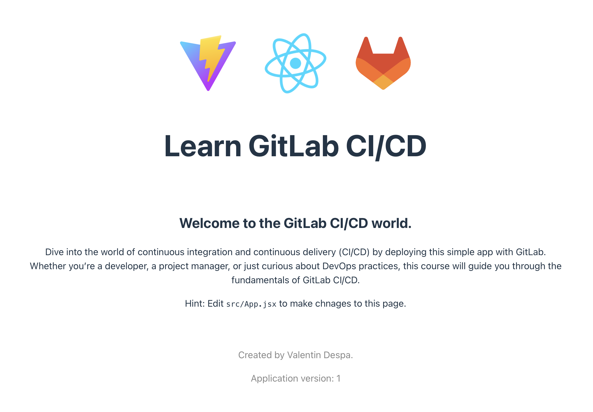

[](https://app.netlify.com/projects/deploy-gitlab-cicd/deploys)

# Learn GitLab CI/CD

This simple web application uses React + Vite.

The project root directory structure includes the following files and directories:
```
.
├── e2e
├── eslint.config.js
├── index.html
├── package-lock.json
├── package.json
├── playwright.config.cjs
├── public
├── README.md
├── src
├── tests
└── vite.config.js
```

The following commands need to run `nodejs` project on project root directory: 

* **Step1**: install all nodejs dependencies:
    ```
    => npm install
    ```
* **Step2**: Then build project:
    ```
    => npm run build 
    
    > learn-gitlab-app@0.0.0 build
    > vite build
    
    vite v6.3.5 building for production...
    ✓ 31 modules transformed.
    build/index.html                   0.47 kB │ gzip:  0.30 kB
    build/assets/react-CHdo91hT.svg    4.13 kB │ gzip:  2.14 kB
    build/assets/index-n_ryQ3BS.css    1.39 kB │ gzip:  0.72 kB
    build/assets/index-pC8zapDL.js   147.40 kB │ gzip: 47.58 kB
    ✓ built in 299ms
    ```

* **Step3**: Install `serve` package in order to run nodejs correctly:
    ```
    => npm install -g serve
  
    added 88 packages in 9s
    
    24 packages are looking for funding
      run `npm fund` for details
    ```

* **Step4**: In the last step, serve nodejs project from build directory:
    ```
    => serve -s build
    
    ┌────────────────────────────────────────────┐
    │                                            │
    │   Serving!                                 │
    │                                            │
    │   - Local:    http://localhost:3000        │
    │   - Network:  http://192.168.248.11:3000   │
    │                                            │
    │   Copied local address to clipboard!       │
    │                                            │
    └────────────────────────────────────────────┘
    ```

* **Step5**: At last, enter `http://localhost:3000` link on your browser to show following page:
  

As you can see, above page represents application version 1.
